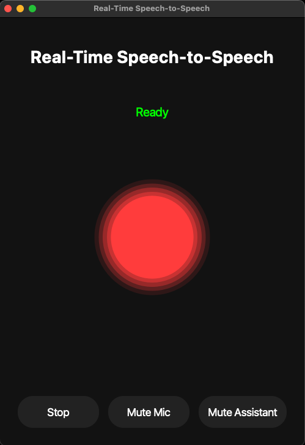
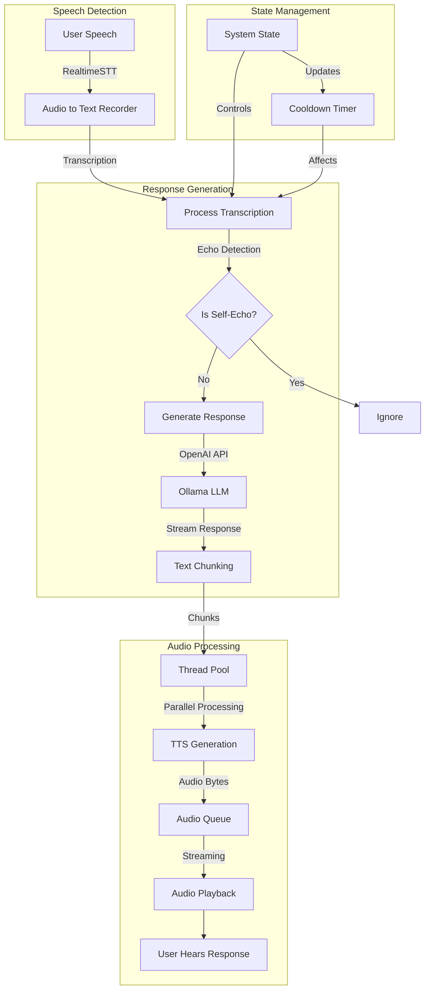

# vibe-coded-speech-to-speech

Almost Real-Time Speech-to-Speech System literally only Vibe Coded using my private Josiefied-Coder-32B model, (this took two days, and I did not write one line LMAO). And with that, welcome to **vibe-coded-speech-to-speech**, a project deeply rooted in the burgeoning field of **vibe coding**. This isn’t just about building a speech-to-speech application; it's about exploring a new way to *create* software – guided by the power of large language models.

## UI Preview

Check out this short demo:

<iframe width="560" height="315" src="https://github.com/Goekdeniz-Guelmez/vibe-coded-speech-to-speech/blob/main/assets/Demo.mov" title="Your Video Title" frameborder="0" allow="accelerometer; autoplay; clipboard-write; encrypted-media; picture-in-picture; web-share" allowfullscreen></iframe>



**What is Vibe Coding?**

Introduced by Andrej Karpathy and now recognized as a trending term, vibe coding represents a revolutionary approach to software development. It’s a technique where you describe a problem or idea in natural language – a few sentences – and a specialized LLM generates the underlying code. Ymy and your role shifts from manual coding to guiding, testing, and refining the AI's output. It's democratizing software creation, allowing individuals with limited programming experience to realize their ideas. [Learn more about Vibe Coding](https://en.wikipedia.org/wiki/Vibe_coding).

**How This Project Embodies Vibe Coding**

With **vibe-coded-speech-to-speech**, I'm not just building software; I'm *demonstrating* the potential of vibe coding in action. I'm using the power of LLMs to generate, refine, and ultimately bring to life a functional and engaging speech-to-speech application. This project highlights the shift in the programmer’s role – from writing lines of code to orchestrating the AI's creative process.

**What's Under the Hood?**

This project brings together some seriously cool tech:

*  **Ollama:** The engine powering our local language model. Get it running: [https://olllama.com](https://olllama.com). Default is `gemma3`.
*  **RealtimeSTT (KoljaB):** This is where the magic happens – converting your voice into text: [https://github.com/KoljaB/RealtimeSTT](https://github.com/KoljaB/RealtimeSTT)
*  **Kokoro-FastAPI (remsky):** I'm leveraging this to bring a modern TTS experience: [https://github.com/remsky/Kokoro-FastAPI](https://github.com/remsky/Kokoro-FastAPI)

**Performance Benchmarks**

On an M4 32GB MacMini with the following Models:
- STT: Whisper Base with VAD
- LLM: gemma3 4B
- TTS: Kokoro TTS

Response latency ranges between 2000 ms and 1000 ms, providing a reasonably interactive experience while running entirely on local hardware.

**Why This Project?**

I'm not just building an application; I'm contributing to the evolution of software development.  We believe that vibe coding has the power to unlock creativity and innovation, empowering a new generation of creators.

## **Installation**

Ready to dive in and experience vibe coding in action? Here's how to get started:

1.  **Clone the Repository:**
    ```bash
    git clone https://github.com/Goekdeniz-Guelmez/vibe-coded-speech-to-speech.git
    ```

2.  **Navigate to the Project Directory:**
    ```bash
    cd vibe-coded-speech-to-speech
    ```

3.  **Install PortAudio (macOS), be sure you have HomeBrew installed:**
    ```bash
    brew install portaudio
    ```

4.  **Install Dependencies:**
    ```bash
    pip install -r requirements.txt
    ```

5.  **Run the Terminal Application:**
    ```bash
    python sts.py
    ```

6.  **Run the minimal UI Application:**
    ```bash
    python sts.py
    ```

6.  **Run the UI version 2 Application:**
    ```bash
    python sts.py
    ```

**This pipeline**

